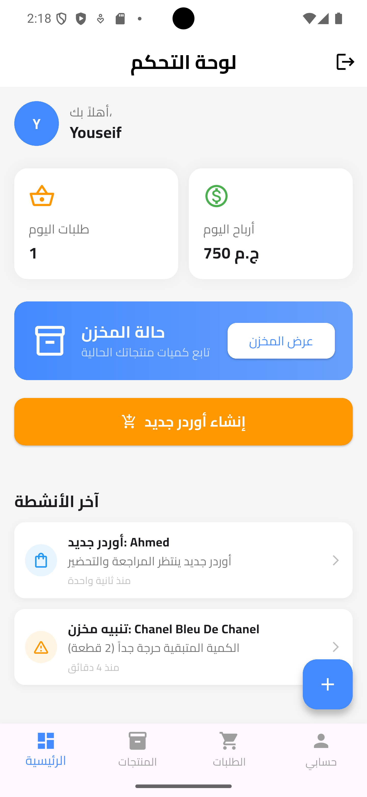
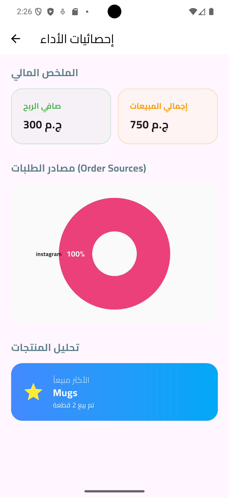
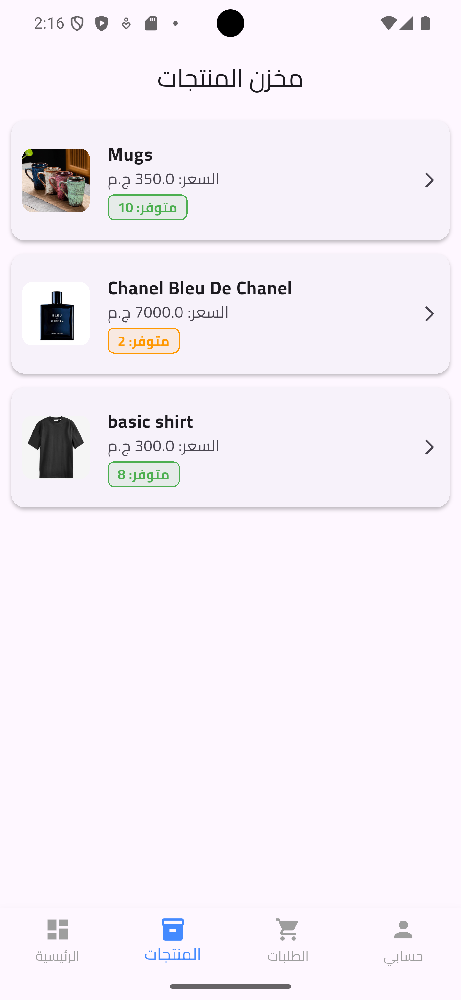
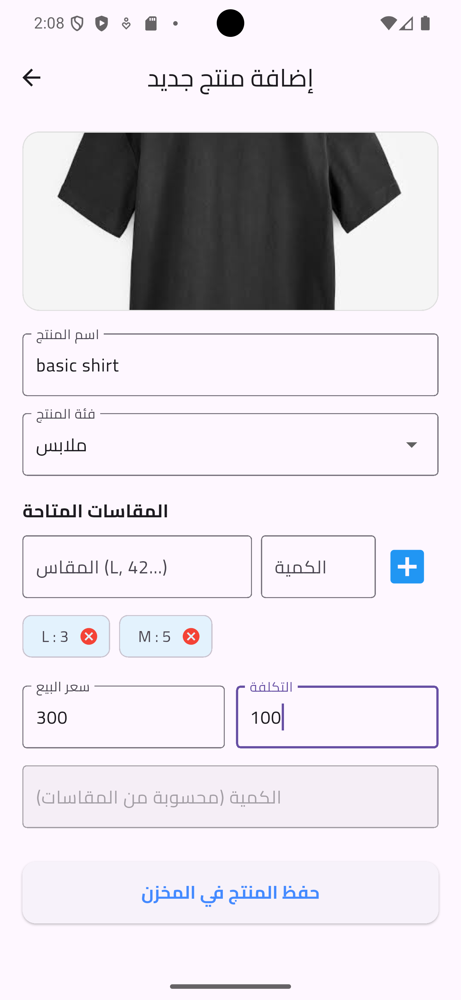
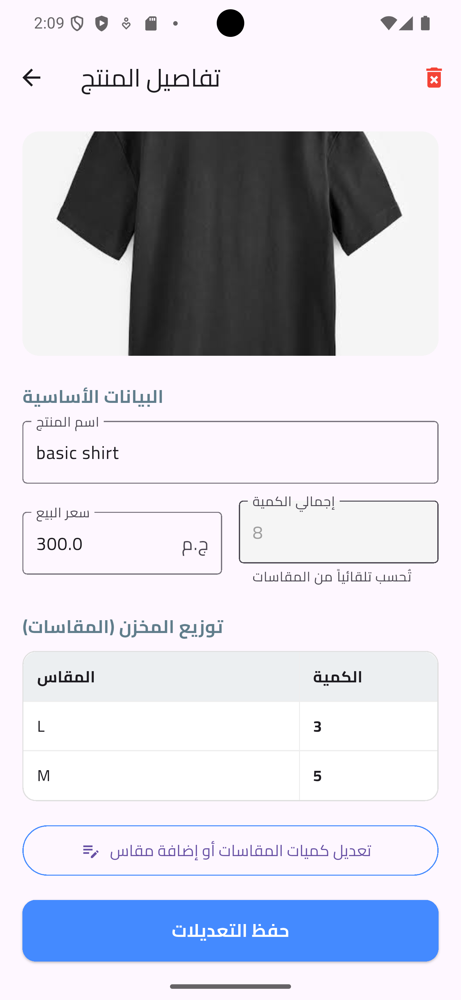
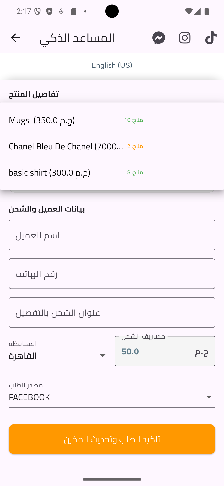
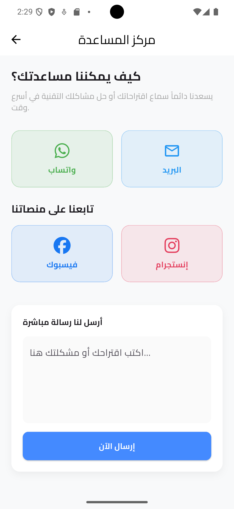

# 🚀 Invento

تطبيق متكامل لإدارة المتاجر مبني باستخدام **Flutter** و **Firebase**، يتبع معايير **Clean Architecture** و **BLoC Pattern** لضمان الكفاءة وقابلية التوسع.

---

## ✨ Key Features | المميزات الرئيسية

- **🛡️ Secure Auth:** نظام تسجيل دخول متكامل (Firebase Auth) مع ميزة استعادة كلمة المرور عبر الإيميل.
- **📈 Advanced Analytics:** لوحة تحكم ذكية لعرض إحصائيات المبيعات، نمو الطلبات، وتحليل الأرباح.
- **⏳ Smart Trial System:** نظام فترة تجريبية (7 أيام) مؤمن عبر **Firestore Server Timestamps** مع شريط تنبيه ديناميكي للمستخدم.
- **🚚 Shipping Engine:** تخصيص أسعار شحن مختلفة لكل محافظة مصرية مع تحديث لحظي للبيانات.
- **⚡ Real-time Sync:** مزامنة فورية للبيانات (الطلبات، المخزن، الأنشطة) باستخدام **Cloud Firestore Streams**.
- **🎨 Modern UI:** واجهة مستخدم نظيفة واحترافية تدعم تجربة المستخدم السلسة مع تحديثات الوقت الحية (Real-time Timeago).

---

## 🛠️ Tech Stack | التقنيات المستخدمة

- **Framework:** [Flutter](https://flutter.dev)
- **State Management:** [Flutter BLoC](https://pub.dev/packages/flutter_bloc) (Event-based logic)
- **Backend:** Firebase (Auth, Firestore, Cloud Messaging)
- **Dependency Injection:** [Get_it](https://pub.dev/packages/get_it) (Service Locator pattern)
- **Security:** [Flutter Dotenv](https://pub.dev/packages/flutter_dotenv) (Protection of sensitive keys)
- **Localization:** Full Arabic support with RTL layouts.

---

## ⚙️ Installation & Setup | الإعداد والتشغيل

1. قم بعمل **Clone** .
2. قم بإنشاء ملف `.env` في المسار الرئيسي للمشروع.
3. أضف المتغيرات التالية:
   ```env
   SUPPORT_PHONE=201xxxxxxxxx
   ADMIN_EMAIL=admin@example.com
   ```

---

## 📸 Screenshots | صور من التطبيق

### 1️⃣ الإدارة والإحصائيات

|                       لوحة التحكم                        |                      إحصائيات الأداء                      |                      الملف الشخصي                      |
| :------------------------------------------------------: | :-------------------------------------------------------: | :----------------------------------------------------: |
|  |  |  |

### 2️⃣ إدارة المنتجات والمخزن

|                      مخزن المنتجات                       |                      إضافة منتج جديد                      |                         تفاصيل المنتج                         |
| :------------------------------------------------------: | :-------------------------------------------------------: | :-----------------------------------------------------------: |
|  |  |  |

### 3️⃣ إدارة الطلبات والذكاء الاصطناعي

|                      قائمة الطلبات                       |                       (إنشاء طلب)                       |                        تفاصيل الطلب                         |
| :------------------------------------------------------: | :-----------------------------------------------------: | :---------------------------------------------------------: |
|  |  |  |

### 4️⃣ الدعم الفني

|                       مركز المساعدة                       |
| :-------------------------------------------------------: |
|  |
